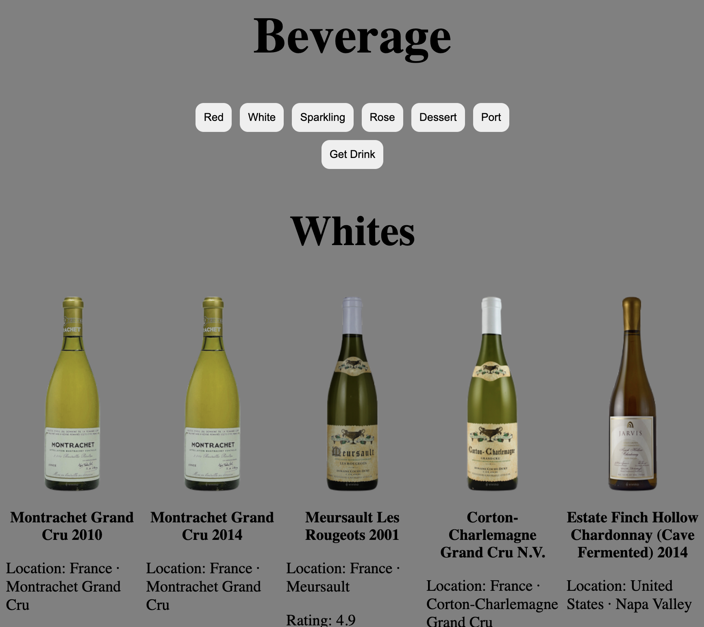

# Wine Cellar App

I created a captivating React application that showcases my proficiency in utilizing powerful hooks like useState, along with essential features like fetch and map. The application seamlessly connects to a sampleAPI, providing a seamless and dynamic user experience.  

## Features
* UseState()
* Fetch
* Map()

